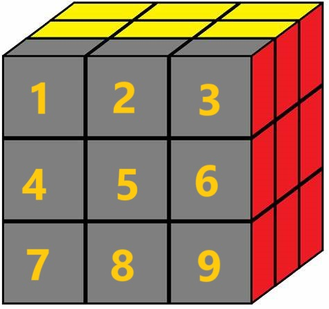

# Rubiks_Cube_Solver

This program solves Rubik's Cubes using the CFOP algorithm.

The method was referenced from the following site: 
[CFOP Speedsolving Method (jperm.net)](https://jperm.net/3x3/cfop)

### How to Run
- Ensure you have CMake and the GNU compiler installed
- Run with: ./CFOP
-	Enter the faces in the following order of their centre pieces: Yellow, White, Orange, Red, Blue, Green (i.e.: Face with yellow centre piece, then face with white centrepiece, etc).
-	Colors of pieces should be entered as follows: 
	Yellow = y (or Y)
	Orange = o (or O)
	Red = r (or R)
	Green = g (or G)
	Blue = b (or B)
	White = w (or W)

### CFOP Algorithm
Has four stages:
1.	Cross
2.	F2L
3.	OLL 
4.	PLL

ASSUMPTIONS:
- Cube oriented with white side down and yellow side up and blue at front

Cube Object:
-	Cube’s faces are stored in an ADT as a 3D vector. Front, Back, Left and Right sides are entered by first rotating the cube to that side, then entering the pieces of the face in the following order:

